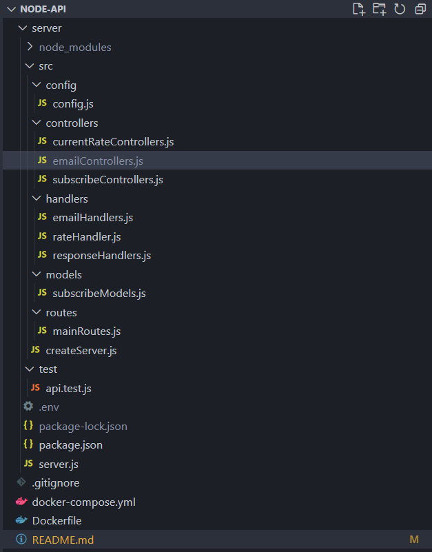
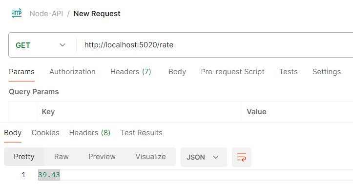
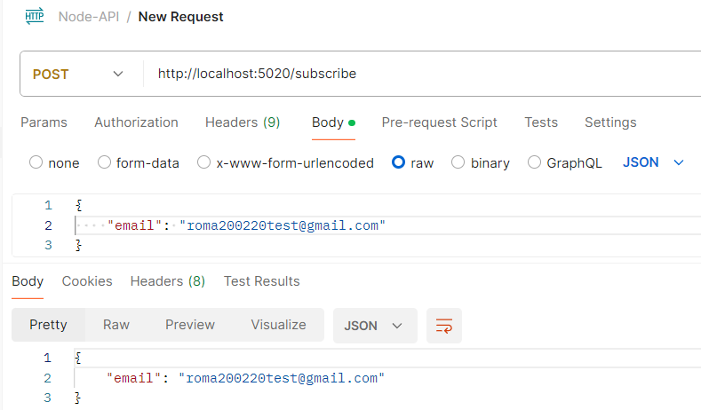
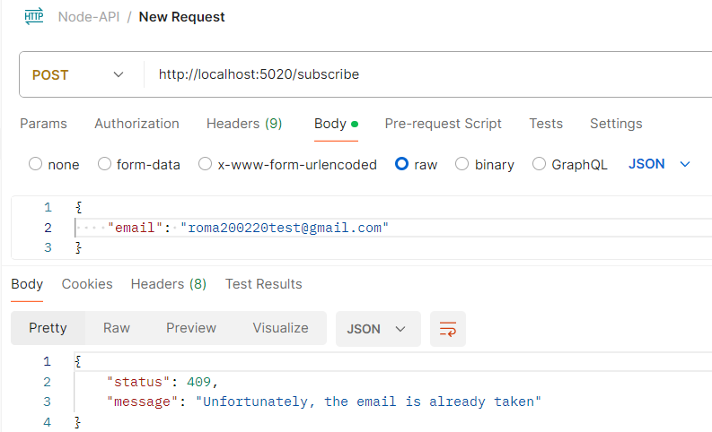
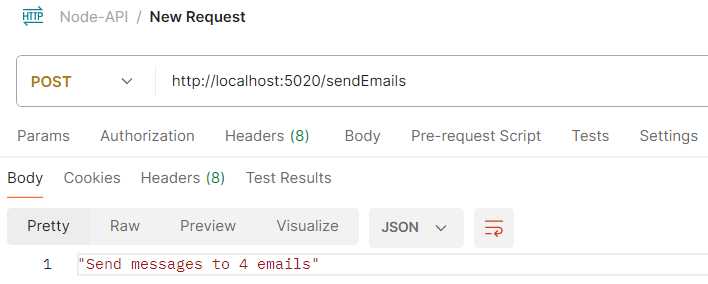
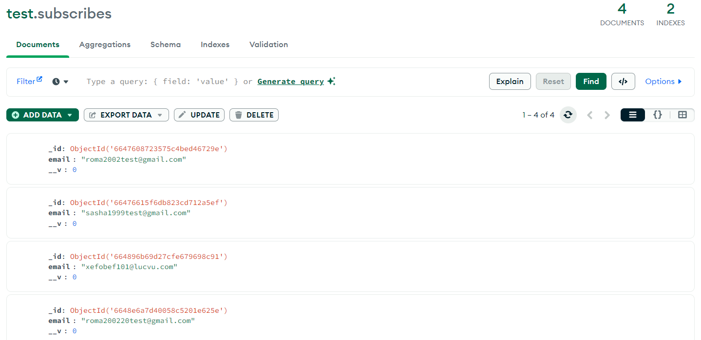
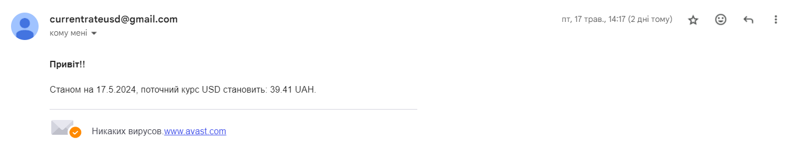
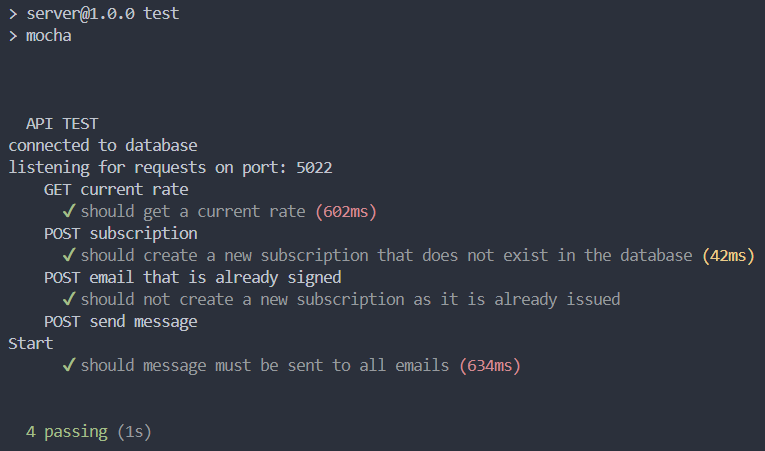

# Node-API
## Introduction
This project implements a reliable and efficient method of receiving and sending the exchange rate of the dollar against the hryvnia. Also developed API will allow you to get the current exchange rate, subscribe to email alerts and send mass emails to your subscribers.

### Особливості
- **Get current exchange rate**: <br>
Implemented easy retrieval of the latest exchange rate for the specified currency. With the help of **rateHandler**, which accepts the parameter of the currency to be received, a request is made to a third-party service ['https://api.exchangerate-api.com/v4/latest/USD'](https://api.exchangerate-api.com/v4/latest/USD) from which you can get the dollar rate against UAH.
- **E-mail subscription**: <br>
Allows users to subscribe to receive a daily message to the specified mail with the current exchange rate of the dollar to the hryvnia. The **subscribeService** service has been implemented, in which the **createSubscribe** method has been created, which first checks whether this mail is already subscribed to the mailing of messages, if so, a response with a 409 code is returned, if this mail does not exist, a subscription is created.
- **Sending email notifications**: <br>
Implements mass email notifications to all subscribers with the latest exchange rate. Using the **emailService** service, in which the **sendEmails** method is implemented, which receives all signed emails from the database and calls **emailHandlers** to send a template message from config.js to all subscribers.

## Uses of tenology

- [Node.js](https://nodejs.org/)
- [Express.js](https://expressjs.com/)
- [Mongoose](https://mongoosejs.com/)
- [Chai](https://www.chaijs.com/), [Mocha](https://mochajs.org/),[Nock](https://github.com/nock/nock) (for testing)
- [Axios](https://axios-http.com/) (for HTTP requests)
- [Nodemailer](https://nodemailer.com/) (for sending messages)
- [Docker](https://www.docker.com/) (for containerization)

## Usage

### Using npm

1. **Cloning**

    ```sh
    git clone https://github.com/YuraShum/Node-API.git
    cd Node-API
    ```
2. **Installing dependencies**

    ```sh
    npm install
    ```

3. **Setting environment variables**<br>
Create an `.env` file in the root of your project and add the environment variables:
    ```env
    PORT = 
    MONGO_URL = 
    GMAIL_USER = 
    GMAIL_PASS = 
    MONGO_URL_TEST = 
    TEST_PORT = 
    ```

4. **Starting the server**

    ```sh
    npm run start
    npm run dev
    ```

    The server should be running `http://localhost:5020`.

5. **Starting tests**

    ```sh
    npm run test
    ```
### Using Docker Compose

1. **Cloning**

    ```sh
    git clone https://github.com/YuraShum/Node-API.git
    cd Node-API
    ```

2. **Setting environment variables**<br>
Create an `.env` file in the root of your project and add the environment variables:
    ```env
    PORT = 
    MONGO_URL = 
    GMAIL_USER = 
    GMAIL_PASS = 
    MONGO_URL_TEST = 
    TEST_PORT = 
    ```

3. **Creating and running the container**

    ```sh
    docker-compose up --build
    ```

    Docker Compose will build the images and run the containers defined in your `docker-compose.yml` file. The server is running at `http://localhost:5020`.

## Description of the project structure


### `src/config`
Contains configuration parameters for the program, among them: **CURRENT_RATE_URL** is used to record the ULR address of receiving the course, **emailMessagePattern** a message pattern that is sent to subscribers by mail.
### `src/controllers`
An important structure that is responsible for processing requests and separating logic from routes and models.
- **currentRateControllers.js**<br>Handles requests related to getting the current exchange rate.
- **emailControllers.js**<br>
Manages e-mail related requests, namely sending bulk messages to subscribers' e-mails.
- **subscribeControllers.js**:
Manages subscription-related requests, namely adding new subscribers.
### `src/handlers`
- **emailHandlers.js**:<br>
Contains logic for handling email sending, formatting, and sending emails through Nodemailer.
- **rateHandler.js**: <br>
Contains logic to retrieve exchange rate data.
- **responseHandlers.js**: <br>
Contains logic for generating responses depending on the status.
### `src/models`
- **subscribeModels.js**: <br>
Defines the Mongoose schema and model for subscribers.
### `src/routes`
- **mainRoutes.js**: <br>
Defines API routes and maps them to the appropriate controllers.
### `src/createServer.js`
- Responsible for creating and configuring the Express server.
### `test`
- **api.test.js**: <br>
This file implements testing of all API endpoints.

## Working capacity
1. **Getting the exchange rate**

   

2. **Valid addition of subscription**

   

3. **Sending already signed mail**

   

4. **Sending messages to mail**

   

5. **Database**

   

6. **The type of message sent to subscribers**

    

7. **Test results**

   