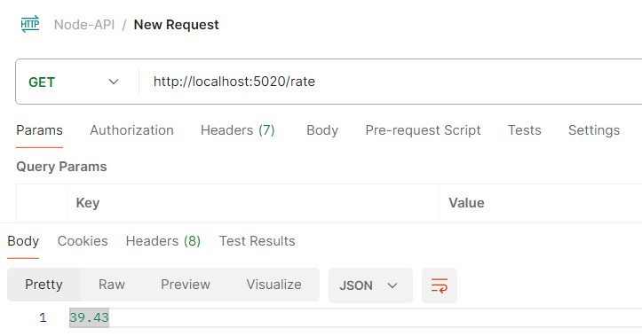
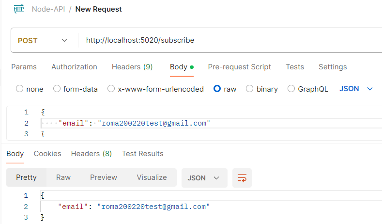
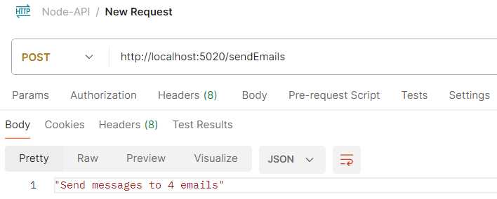
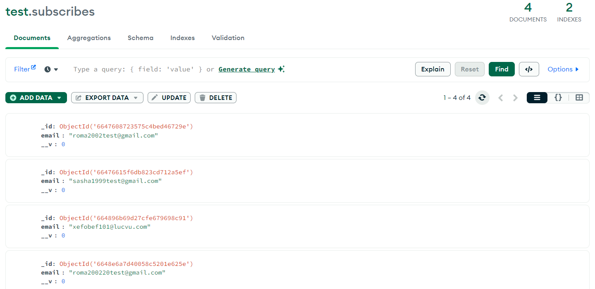
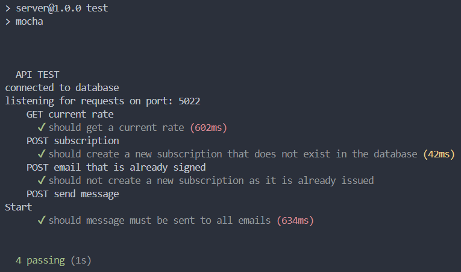

# Node-API
## Вступ
У даному проекті реалізовано надійний та ефективний спосіб отримання та відправки курсу долара відносно гривні. Також розроблене API дозволить вам отримати поточний курс обміну, підписатися на сповіщення електронною поштою та надіслати масові листи своїм підписникам.

### Особливості
- **Отримати поточний обмінний курс**: <br>
Реалізовано легке отримання останнього обмінного курсу для вказаної валюти. За допомогою **rateHandler** який приймає параметр валюти яку потрібно отримати, виконується запит на стороній сервіс ['https://api.exchangerate-api.com/v4/latest/USD'](https://api.exchangerate-api.com/v4/latest/USD) з якого можна отримати курс долара відносно UAH.
- **Підписка на електронну пошту**: <br>
Дозволяє користувачам підписуватись на отримання щоденного повідомлення на вказану пошту з актуальним курсом долара до гривні. Реалізовано сервіс **subscribeService** в якому створений метод **сreateSubscribe** який спочатку перевіряє чи чи дана пошта вже підписана на розсилку повідомлень, якщо так вертається відповідь із 409 кодом, якщо даної пошти немає створюється підписка.
- **Надсилання сповіщень електронною поштою**: <br>
Реалізовує масові сповіщення електронною поштою всім підписникам із останнім курсом валют. За допомогою сервісу **emailService** в якому реалізований метод **sendEmails** який отримує всі підписанні емейли із бази даних та викликає **emailHandlers** для відправики шаблонного повідомлення із config.js всім підписникам.

## Використанні тенології

- [Node.js](https://nodejs.org/)
- [Express.js](https://expressjs.com/)
- [Mongoose](https://mongoosejs.com/)
- [Chai](https://www.chaijs.com/), [Mocha](https://mochajs.org/), [Nock](https://github.com/nock/nock) (для тестування)
- [Axios](https://axios-http.com/) (для HTTP запитів)
- [Nodemailer](https://nodemailer.com/) (для відправки повідомлень)
- [Docker](https://www.docker.com/) (для контейнеризації)

## Використання

### Використання npm

1. **Клонування**

    ```sh
    git clone https://github.com/YuraShum/Node-API.git
    cd Node-API
    ```
2. **Встановлення залежностей**

    ```sh
    npm install
    ```

3. **Налаштування змінних середовища**<br>
Створіть файл `.env` у корені вашого проекту та додайте змінні середовища:
    ```env
    PORT = 
    MONGO_URL = 
    GMAIL_USER = 
    GMAIL_PASS = 
    MONGO_URL_TEST = 
    TEST_PORT = 
    ```

4. **Запуск сервера**

    ```sh
    npm run start
    npm run dev
    ```

    Cервер повинен працювати `http://localhost:5020`.

5. **Запуск тестів**

    ```sh
    npm run test
    ```
### Використання Docker Compose

1. **Клонування**

    ```sh
    git clone https://github.com/YuraShum/Node-API.git
    cd Node-API
    ```

2. **Налаштування змінних середовища**<br>
Створіть файл `.env` у корені вашого проекту та додайте змінні середовища:
    ```env
    PORT = 
    MONGO_URL = 
    GMAIL_USER = 
    GMAIL_PASS = 
    MONGO_URL_TEST = 
    TEST_PORT = 
    ```

3. **Створення та запуск контейнера**

    ```sh
    docker-compose up --build
    ```

    Docker Compose створить зображення та запустить контейнери, визначені у вашому файлі `docker-compose.yml`. Сервер працює на `http://localhost:5020`.

## Опис стркткури проекту


### `src/config`
Містить параметри конфігурації для програми серед них: **CURRENT_RATE_URL** слугує для запису ULR атреси отримання курсу, **emailMessagePattern** шаблон повідомлення яке відправляється підписникам на пошту.
### `src/controllers`
Важлива структура яка відповідає за обробку запитів та розділення логіки від маршутів та моделей.
- **currentRateControllers.js**<br>Обробляє запити, пов’язані з отриманням поточного обмінного курсу.
- **emailControllers.js**<br> 
Керує запитами, пов’язаними з електронною поштою а саме надсилає масові повідомлення на електронні пошти підписників.
- **subscribeControllers.js**: 
Керує запитами, пов’язаними з підпискою а саме додавання нових підписників.

### `src/handlers`
- **emailHandlers.js**:<br>
Містить логіку для обробки надсилання електронної пошти,форматування та надсилання електронних листів через Nodemailer.
- **rateHandler.js**: <br>
Містить логіку для отримання даних про обмінний курс.
- **responseHandlers.js**: <br>
Містить логіку для формування відповідей в залежності від статусу.
### `src/models`
- **subscribeModels.js**: <br>
Визначає схему та модель Mongoose для підписників
### `src/routes`
- **mainRoutes.js**: <br>
Визначає маршрути API та відображає їх у відповідних контролерах.
### `src/createServer.js`
- Відповідає за створення та налаштування сервера Express.
### `test`
- **api.test.js**: <br>
У даному файлі реалізовано тестування усіх кінцевих точок API.

## Працездатність
1. **Отримання курсу валюти**

   

2. **Валідне додання підписки**

   

3. **Відправка вже підписаної пошти**

   

4. **Відправлення повідомлень на пошту**

   

5. **База даних**

   

6. **Результати виконання тестів**

   